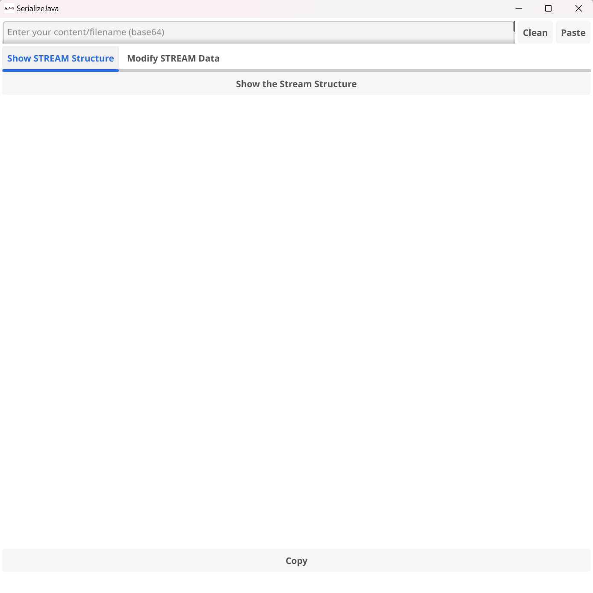
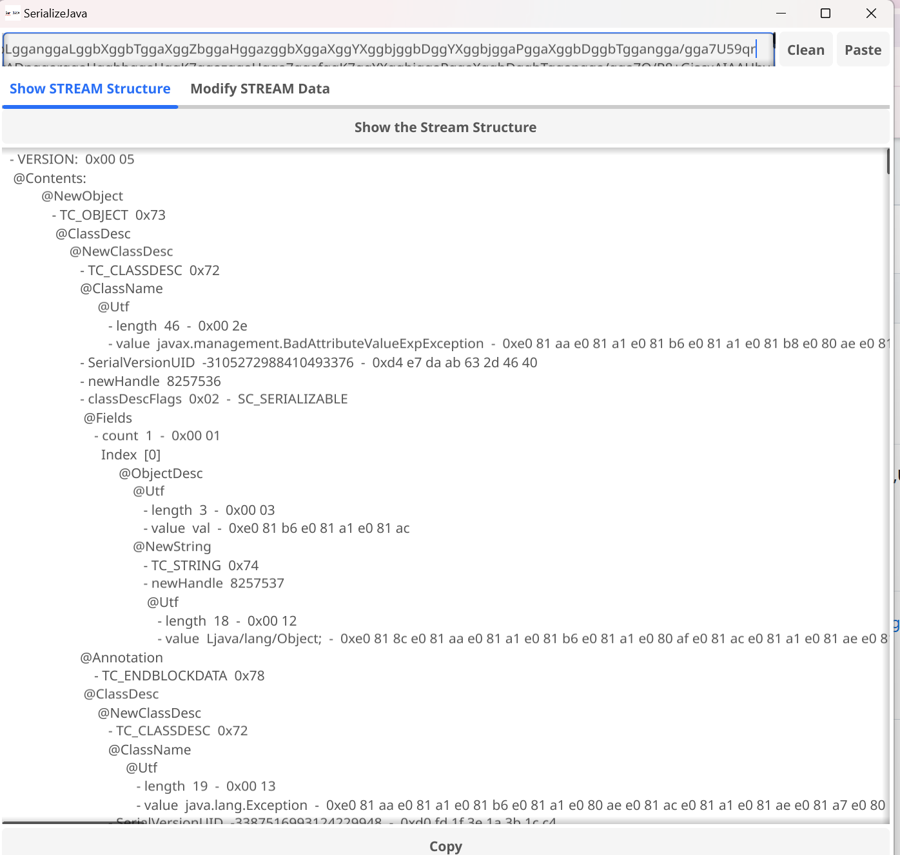
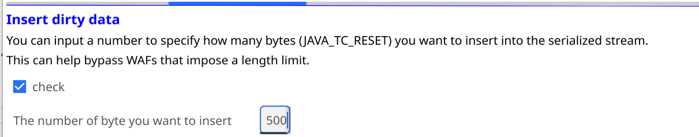
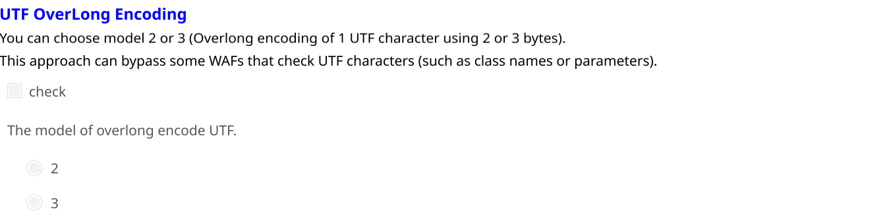
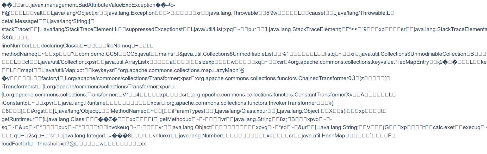
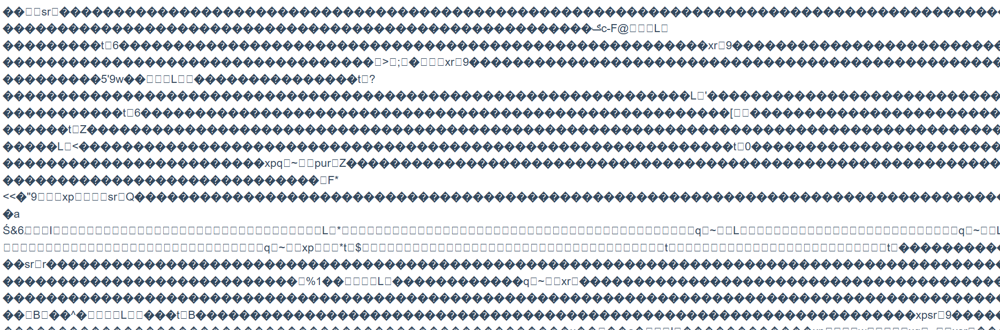
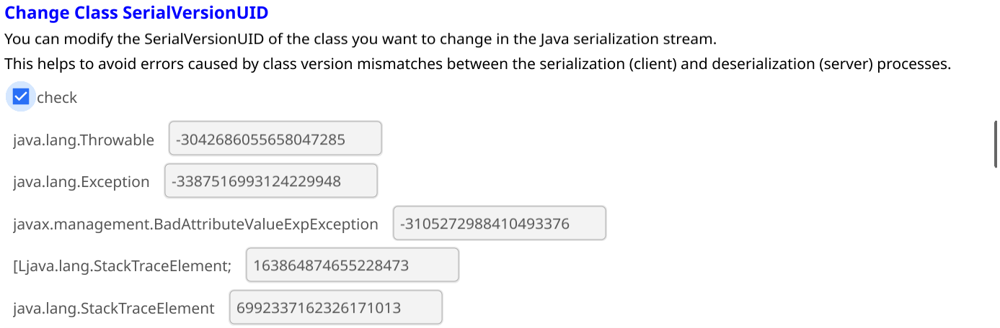

# SerializeJava
**SerializeJava是用Go语言+GUI库Fyne开发的，展示JAVA序列化流以及集成一键插入脏数据,UTF过长编码绕WAF(Utf OverLoad Encoding),修改类SerializeVersionUID功能的图形化工具。**
# 使用介绍
下载源码后在根目录运行go run main.go或直接下载运行发行版中的exe文件。

## 展示序列化流结构
输入一段JAVA对象的序列化流Base64编码，点击"show the Stream Structure"

## 插入脏数据

输入你想要插入的字节数。
这个功能可以来绕过一些限制检测长度的WAF，由于这里插入脏数据的部分位于序列化流的前面，可以使得WAF检测不到危险的序列化数据。
本工具插入的是序列化流中的TC_RESET--(byte)0x79。
然后点击最下面的change按钮，便可以生成相应的序列化流Base64编码。(可与其它功能一键使用)
## 过长UTF字符编码

可以选择对UTF进行二字节编码或三字节编码。
一般的UTF字符是由一个byte进行编码，如'a'对应97。而JAVA的反序列化中支持将两个或三个byte解码成UTF字符，此时UTF字符'a'将会变成两个不可见及三个的byte，可以绕过一些检测UTF字符的检测机制(如检测恶意类，恶意参数。)
比如CC5在一字节UTF编码的情况下：

而对其进行二字节UTF编码的情况下：

同样的，选择后可以点击change按钮生成相应的Base64编码(可与其它功能一键使用)
## 改变SerialVerionUID

输入序列化流base64编码后，点击check会先解析出流中各个类的类名及其SerialVersionUID，可在输入框中改变相应数据。
这样可以避免反序列化端(服务端)与序列化端(客户端)使用的版本不一致(由SerialVersionUID判断)引发的错误。
同样的，改变可以点击change按钮生成相应的Base64编码(可与其它功能一键使用)